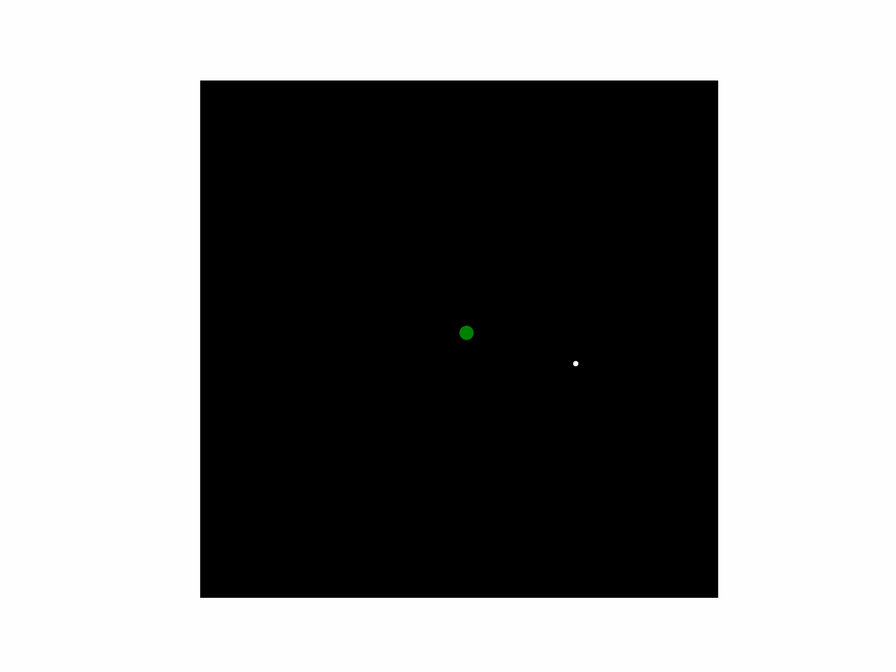

# Earth Moon Simulation

This project simulates the orbital dynamics between the Earth and the Moon using Python. It makes use of classical Newtonian mechanics, specifically Newton's gravitational law for the interaction between the Earth and Moon. It also takes into account the Earth's axial rotation for added realism.

 

## Dependencies

This project requires the following Python libraries:  

- `numpy` – for numerical calculations  
- `matplotlib` – for visualization  
- `pillow` - for handling and saving images

These dependencies will be installed automatically using the steps below.

## Installation

1. Clone the repository:
    ```sh
    git clone https://github.com/mariannexkuhl/EarthMoonSimulation.git
    ```
2. Navigate to the project directory:
    ```sh
    cd EarthMoonSimulation
    ```
3. Install the required dependencies:
    ```sh
    pip install -r requirements.txt
    ```

## Usage

To run the simulation, use the following command:
```sh
python Earth_Moon_Simulation.py
```
## Technical Details

This simulation models the Earth-Moon system using Newton's law of universal gravitation:

`F = G * (m1 * m2) / r^2`

where:
- F is the gravitational force
- G  is the gravitational constant
- m_1  and  m_2  are the masses of the Earth and Moon respectively
- r is the distance between their centers

### Numerical Integration

- The equations of motion are solved using explicit Euler integration to update the position and velocities of both bodies at each time step. 
- The time step dt is chosen to balance accuracy and computational efficiency. In this simulation it was chosen to be 1 hour (3600 seconds).

### Visualization

- The simulation is rendered using `matplotlib`, with the positions of the Earth and Moon updated at each time step
- `Pillow` is used to save frames if the user wants to generate an animation
- The Earth's axial rotation is included for visual realism but does not affect the orbital dynamics

### Assumptions & Limitations

- Gravitational influence and perturbations from all other bodies are ignored, including the Sun's 
- The Earth and Moon are treated as point masses
- The Earth's rotation does not influence the Moon’s motion in this model


## Contributing

Contributions are welcome! Please fork the repository and submit a pull request.

## License

This project is licensed under the MIT License.
